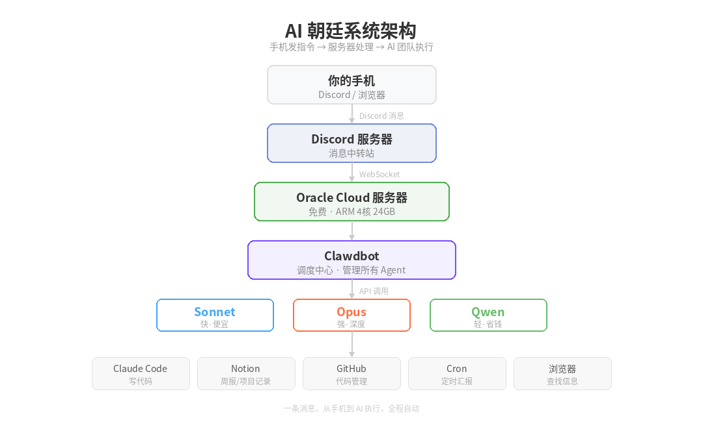
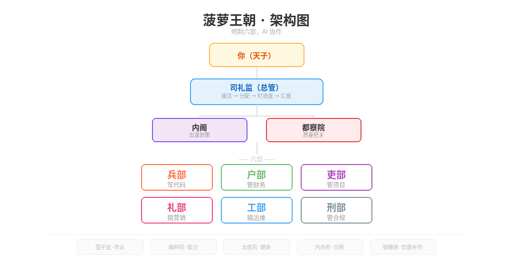

# 🏛️ 30 分钟搭建你的 AI 朝廷

> 一台免费服务器 + [Clawdbot](https://github.com/clawdbot/clawdbot) = 一支 7×24 在线的 AI 团队

写代码、管财务、搞营销、写日报、运维部署——你只需要在 Discord 里发一条消息。



---

## 为什么选这套方案？

| | ChatGPT / Claude 网页版 | AutoGPT / CrewAI / MetaGPT | **AI 朝廷（本方案）** |
|---|---|---|---|
| 多 Agent 协作 | ❌ 单个通才 | ✅ 需写 Python 编排 | ✅ 配置文件搞定，零代码 |
| 独立记忆 | ❌ 对话结束即失忆 | ⚠️ 需自己接向量库 | ✅ 每个 Agent 独立工作区 + memory 文件 |
| 工具集成 | ⚠️ 有限插件 | ⚠️ 需自己开发 | ✅ 60+ 内置 Skill（GitHub / Notion / 浏览器 / Cron …） |
| 界面 | 网页 | 命令行 / 自建 UI | ✅ Discord 原生（手机电脑都能用） |
| 部署难度 | 无需部署 | 需 Docker + 编码 | ✅ 一键脚本，5 分钟跑起来 |
| 成本 | $20/月订阅 | API 费 + 服务器 | ✅ 服务器永久免费，只付 API 费（$10-30/月） |
| 24h 在线 | ❌ 需手动对话 | ✅ | ✅ 定时任务 + 心跳自检 |

**核心优势：不是框架，是成品。** 跑个脚本就能用，在 Discord 里 @谁谁回复。

---

## 技术架构

```
Discord 消息
    ↓
Clawdbot Gateway（Node.js 守护进程）
    ├── 消息路由：@mention → 匹配 binding → 分发到对应 Agent
    ├── 会话隔离：每个 Agent 独立会话、独立工作目录
    ├── 自动 Thread：大任务自动开 Thread，频道不刷屏
    └── Cron 调度：定时触发 Agent 执行任务
         ↓
    ┌─────────┐  ┌─────────┐  ┌─────────┐
    │ 兵部    │  │ 户部    │  │ 礼部    │  ... (可扩展)
    │ Opus    │  │ Opus    │  │ Sonnet  │
    │ 编码专家│  │ 财务专家│  │ 营销专家│
    └────┬────┘  └────┬────┘  └────┬────┘
         │            │            │
    ┌────┴────────────┴────────────┴────┐
    │         Skill 工具层（60+）        │
    │  GitHub · Notion · 浏览器 · Cron  │
    │  TTS · 天气 · 截图 · 视频处理 …  │
    └───────────────────────────────────┘
```

每个 Agent 是一个独立的 Discord Bot，绑定独立的 AI 身份：
- **独立记忆**：每个 Agent 有自己的 `memory/` 目录，越用越懂你
- **独立模型**：重活用 Opus，轻活用 Sonnet，省钱又高效
- **独立沙箱**：Agent 代码执行互不干扰，安全隔离
- **身份注入**：Clawdbot 自动将 SOUL.md + IDENTITY.md + 工作区文件组装为系统提示

---

## 快速开始

### 第一步：一键部署（5 分钟）

领好 [Oracle Cloud 免费服务器](https://www.oracle.com/cloud/free/)（ARM 4核 24GB，永久免费），SSH 连上，跑这一行：

```bash
bash <(curl -fsSL https://raw.githubusercontent.com/wanikua/boluobobo-ai-court-tutorial/main/install.sh)
```

脚本自动完成：
- ✅ 系统更新 + Oracle 防火墙配置
- ✅ 4GB Swap（防 OOM）
- ✅ Node.js 22 + GitHub CLI + Chromium
- ✅ Clawdbot 全局安装
- ✅ 工作区初始化（SOUL.md / IDENTITY.md / USER.md / clawdbot.json 多 Agent 模板）
- ✅ Gateway 系统服务安装（开机自启）

安装脚本带彩色输出和进度提示，每一步都有 ✓ 成功标记。

### 第二步：填 Key 上线（10 分钟）

跑完脚本，你只需要填两样东西：

1. **Anthropic API Key** → [console.anthropic.com](https://console.anthropic.com)
2. **Discord Bot Token**（每个部门一个）→ [discord.com/developers](https://discord.com/developers/applications)

```bash
# 编辑配置，填入 API Key 和 Bot Token
nano ~/.clawdbot/clawdbot.json

# 启动朝廷
systemctl --user start clawdbot-gateway

# 验证
systemctl --user status clawdbot-gateway
```

在 Discord @你的 Bot 说句话，收到回复就成功了。

### 第三步：全六部上线 + 自动化（15 分钟）

```
@兵部 帮我写个用户登录的 API
→ 兵部（Opus）：完整代码 + 架构建议，大任务自动开 Thread

@户部 这个月 API 花了多少钱
→ 户部（Opus）：费用明细 + 优化建议

@礼部 写条小红书文案，主题是 AI 工具推荐
→ 礼部（Sonnet）：文案 + 标签建议

@everyone 明天下午开会，各部门准备周报
→ 所有 Agent 各自回复确认
```

配置自动日报：
```bash
# 获取 Gateway Token
clawdbot gateway token

# 每天 22:00（北京时间）自动生成日报
clawdbot cron add \
  --name "每日日报" --agent main \
  --cron "0 22 * * *" --tz "Asia/Shanghai" \
  --message "生成今日日报，写入 Notion 并发送到 Discord" \
  --session isolated --token <你的token>
```



---

## 朝廷架构——六部制

灵感来自明朝六部制度，每个"部门"是一个独立的 AI Agent + Discord Bot：

| 部门 | 职责 | 推荐模型 | 典型场景 |
|------|------|----------|----------|
| **司礼监** | 总管调度 | Claude Sonnet | 日常对话、任务分配、自动汇报 |
| **兵部** | 软件工程 | Claude Opus | 写代码、架构设计、代码审查、Bug 调试 |
| **户部** | 财务运营 | Claude Opus | 成本分析、预算管控、电商运营 |
| **礼部** | 品牌营销 | Claude Sonnet | 文案创作、社媒运营、内容策划 |
| **工部** | 运维部署 | Claude Sonnet | DevOps、CI/CD、服务器管理 |
| **吏部** | 项目管理 | Claude Sonnet | 创业孵化、任务追踪、团队协调 |
| **刑部** | 法务合规 | Claude Sonnet | 合同审查、知识产权、合规检查 |

> 💡 模型分层策略：重活（编码/分析）用 Opus，轻活（文案/管理）用 Sonnet，能省 10 倍成本。也可以接入 Qwen 等国产模型进一步降本。

---

## 核心能力

### 🤖 多 Agent 协作
每个部门是独立 Bot，@谁谁回复，@everyone 全员响应。大任务自动新建 Thread 保持频道整洁。

### 🧠 独立记忆系统
每个 Agent 有独立的工作区和 `memory/` 目录。对话积累的项目知识会持久化到文件，跨会话保留。Agent 越用越懂你的项目。

### 🛠️ 60+ 内置 Skill
不只是聊天——内置的工具覆盖开发全流程：

| 类别 | Skill |
|------|-------|
| 开发 | GitHub（Issue/PR/CI）、Coding Agent（Claude Code） |
| 文档 | Notion（数据库/页面/自动汇报） |
| 信息 | 浏览器自动化、Web 搜索、Web 抓取 |
| 自动化 | Cron 定时任务、心跳自检 |
| 媒体 | TTS 语音、截图、视频帧提取 |
| 运维 | tmux 远程控制、Shell 命令执行 |
| 通信 | Discord、Slack、Telegram、WhatsApp、Signal… |

### ⏰ 定时任务（Cron）
内置 Cron 调度器，让 Agent 定时自动执行：
- 每天自动写日报，发到 Discord + 存到 Notion
- 每周汇总周报
- 定时健康检查、代码备份
- 自定义任意定时任务

### 👥 好友协作
邀请朋友进 Discord 服务器，所有人都能 @各部门 Bot 下达指令。互不干扰，结果大家都能看到。

### 🔒 沙箱隔离
Agent 可以运行在 Docker 沙箱中，代码执行互不干扰。支持配置网络、文件系统、环境变量的隔离级别。

---

## 详细教程

基础篇（服务器申请→安装→配置→跑起来）和进阶篇（tmux、GitHub、Notion、Cron、Discord、Prompt 技巧）见小红书系列笔记。

---

## 常见问题

### 基础问题

**Q: 需要会写代码吗？**
不需要。一键脚本搞定安装，配置文件填几个 Key 就行。所有交互都是在 Discord 里用自然语言。

**Q: 服务器真的免费吗？**
Oracle Cloud Always Free 套餐，ARM 4核 24GB 内存 200GB 磁盘，永久免费。需要 Visa/MasterCard 注册（预授权 $1 后退回，不扣费）。

**Q: 和直接用 ChatGPT 有什么区别？**
ChatGPT 是一个通才，对话结束就失忆。这套系统是多个专家——每个 Agent 有自己的专业领域、持久记忆和工具权限。能自动写代码提交 GitHub、自动写文档到 Notion、定时执行任务。

**Q: 能用其他模型吗？**
能。Clawdbot 支持 Anthropic、OpenAI、Google Gemini、通义千问（Qwen）等。在 `clawdbot.json` 里改 model 配置就行。不同部门可以用不同模型。

**Q: 每月 API 费用大概多少？**
看使用强度。轻度使用 $10-15/月，中度 $20-30/月。省钱技巧：重活用 Opus，轻活用 Sonnet（便宜 5 倍），简单任务用 Qwen（便宜 50 倍）。

### 技术问题

**Q: @everyone 不触发 Agent 回复？**
Discord Developer Portal 里每个 Bot 要开启 **Message Content Intent** 和 **Server Members Intent**，服务器里 Bot 角色要有 View Channels 权限。Clawdbot 会把 @everyone 当作对每个 Bot 的显式 mention，权限到位就能触发。

**Q: 开了 sandbox 后 Agent 报没有权限写文件？**
sandbox mode 设成 `all` 会把 Agent 跑在 Docker 容器里，默认只读文件系统、断网、不继承环境变量。解决方法：

```json
"sandbox": {
  "mode": "all",
  "workspaceAccess": "rw",
  "docker": {
    "network": "bridge",
    "env": { "ANTHROPIC_API_KEY": "sk-..." }
  }
}
```
- `workspaceAccess: "rw"` — 让沙箱能读写工作目录
- `docker.network: "bridge"` — 允许联网
- `docker.env` — 传入 API Key（沙箱不继承主机环境变量）

**Q: 多人同时 @ 同一个 Agent 会冲突吗？**
不会。Clawdbot 为每个用户 × Agent 组合维护独立的会话（session）。多人同时 @兵部，各自的对话互不干扰。

**Q: Agent 之间能互相调用吗？**
能。Agent 可以通过 `sessions_spawn` 产生子任务给其他 Agent，也可以通过 `sessions_send` 发消息给其他 Agent 的会话。比如司礼监可以把编码任务派给兵部。

**Q: 怎么自定义 Skill？**
Clawdbot 有内置的 Skill Creator 工具，可以创建自定义 Skill。每个 Skill 是一个包含 `SKILL.md`（指令）+ 脚本 + 资源的目录。放到工作区的 `skills/` 目录下即可被 Agent 使用。

**Q: 怎么接入私有模型（Ollama 等）？**
在 `clawdbot.json` 的 `models.providers` 中添加兼容 OpenAI API 格式的 provider，指定 `baseUrl` 到你的 Ollama 地址即可。Ollama 本地模型零 API 费用。

**Q: Gateway 启动失败怎么排查？**
```bash
# 查看详细日志
journalctl --user -u clawdbot-gateway --since today --no-pager

# 配置检查
clawdbot doctor

# 常见原因：API Key 未填、JSON 格式错误、Bot Token 无效
```

---

## 相关链接

- [Clawdbot 官方文档](https://docs.clawd.bot)
- [Clawdbot GitHub](https://github.com/clawdbot/clawdbot)
- [Oracle Cloud 免费套餐](https://www.oracle.com/cloud/free/)
- [Anthropic API](https://console.anthropic.com)

---

v3.4 | MIT License
